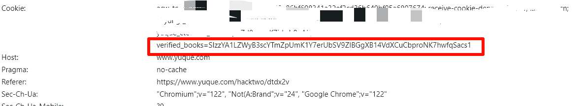

# yuque-spider-plus

该项目基于https://github.com/burpheart/yuque-crawl项目进行修改

语雀文档抓取工具（爬虫） 可以保存任意用户整个语雀知识库为Markdown格式 (包含完整目录结构和索引) 


使用：
安装 python3

https://www.python.org/downloads/

执行安装运行模块
`pip install requests`

执行抓取：

`python3 main.py 语雀文档地址`

demo：
`python3 main.py https://www.yuque.com/burpheart/phpaudit`


# 额外添加功能

增加需要密码需要设置cookie功能爬取



命令行 

```shell
python main.py https://www.yuque.com/xxx/xxx "vertified_books=******"
```


